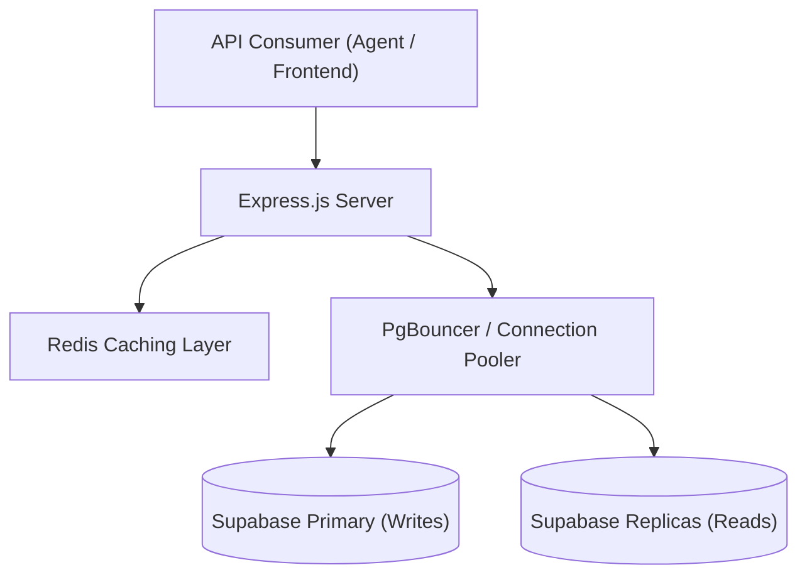

# IREPS Backend: Scalable Tender Platform Specification

## 1. Project Overview
This project is a high-performance backend solution for the **Indian Railways e-Procurement System (IREPS)** tender data platform. It is engineered as a modular, "plug-and-play" Node.js application capable of serving thousands of concurrent users and handling massive datasets (17,000+ records) with millisecond latency.

---

## 2. System Architecture
The architecture follows a strictly decoupled, service-oriented pattern to ensure maximum scalability and ease of integration into existing enterprise environments.

---

## 3. Technology Stack & Rationale
| Component | Technology | Rationale |
| :--- | :--- | :--- |
| **Runtime** | Node.js | Non-blocking I/O ideal for high-concurrency agentic flows. |
| **Framework** | Express.js | Industry standard for building modular, plug-and-play REST APIs. |
| **Primary DB** | PostgreSQL (Supabase) | Robust relational engine with native Full-Text Search capabilities. |
| **Cache Layer** | Redis Labs | In-memory data store used to achieve <5ms response times. |
| **ORM/Driver** | `pg` + `pg-pool` | Low-level control over connection pooling and raw SQL performance. |
| **Data Ingestion** | `xlsx` | Efficient batch processing of Excel-based tender datasets. |

---

## 4. Key Architectural Features

### 📡 Read/Write Operation Separation (CQRS-Lite)
The system implements a strict separation between **Write** and **Read** operations. 
- **`writePool`**: Directed to the primary database for all mutations.
- **`readPool`**: Configured to fall back to the primary but ready to point to infinite read-replicas. 
This ensures that scaling the database horizontally is a zero-code-change operation.

### ⚡ Integrated Redis Caching
A custom middleware (`middleware/cache.js`) intercepts all `GET` requests.
- **TTL Matching**: Results are cached with a configurable Time-To-Live.
- **Zero-DB Load**: Frequent searches (e.g., "new tenders today") are served directly from Redis, protecting PostgreSQL from traffic spikes.

### 🔍 Optimized Full-Text Search (FTS)
Instead of relying on slow `LIKE` queries, the system uses PostgreSQL **GIN (Generalized Inverted Index)**.
- **Index**: `idx_tenders_title_fts` using `to_tsvector`.
- **Performance**: Provides industrial-grade search performance across 17k+ descriptions without the overhead of external search engines like Elasticsearch.

---

## 5. Data Migration Lifecycle
The project included a full migration of the IREPS dataset:
- **Dataset**: 17,214 records from `ireps_tenders_full.xlsx`.
- **Idempotency**: Using `INSERT ... ON CONFLICT (tender_no) DO UPDATE`, ensuring that data ingestion is idempotent and crash-resilient.
- **Batch Processing**: Ingested in chunks of 100 records to maintain optimal memory usage and database throughput.

---

## 6. API Documentation

### `GET /api/tenders`
Fetches a paginated list of tenders.
- **Query Params**:
  - `q`: Search keyword (Full-Text Search).
  - `status`: Filter by tender status.
  - `work_area`: Filter by work area.
  - `limit`: Page size (default 50).
  - `offset`: Start position.
- **Response**: Returns `tenders` array, `total` count, `limit`, and `offset`.

### `GET /api/tenders/:tender_no`
Fetches a single tender by its unique identifier.

---

## 7. Scaling Roadmap (1 Lakh+ Users)
The architecture is **"Scale-Out Ready"**:
1. **Vertical**: Upgrade Supabase/Redis compute tiers for higher throughput.
2. **Horizontal**: Deploy the Node.js instances behind a Load Balancer. 
3. **Edge**: Integrate Cloudflare as a CDN to serve cached JSON responses at the network edge.

---

## 8. Deployment & Setup
1. **Environment**: Configure `.env` with Supabase and Redis credentials.
2. **Initialize**: Run `node init-db.js` to set up the schema.
3. **Migrate**: Run `node import-data.js` to ingest the 17k records.
4. **Launch**: `npm start` or `npm run dev`.
